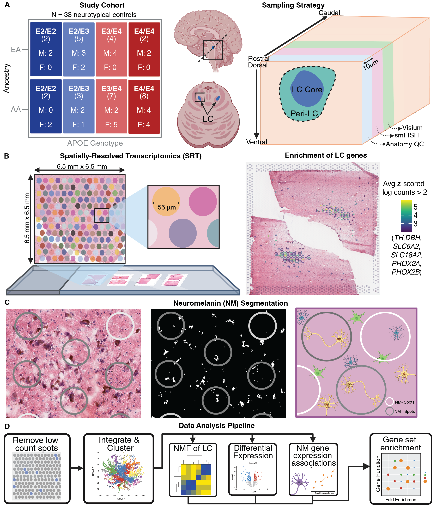
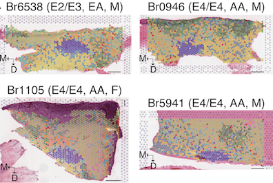

# Impact of Alzheimer’s disease risk factors and local neuromelanin content on the transcriptomic landscape of the human locus coeruleus

### Study Design
The locus coeruleus (LC) is a small noradrenergic nucleus in the dorsal pons that sends widespread projections regulating many functions, including sleep, memory, arousal, and cognition. LC neurons have characteristic features associated with Alzheimer’s disease (AD), including accumulation of AD pathology precursor phospho-tau (pTau) throughout adulthood and accelerated loss of neuromelanin (NM) pigmentation over the course of AD. NM-sensitive neuroimaging predicts clinical severity and future AD progression. While these findings suggest an etiologic role for the LC in AD, the molecular landscape of the LC in middle age prior to clinical manifestation of sporadic AD remains undescribed. This information is critical to developing interventions that preserve the LC and the functions it supports. We perform spatially-resolved transcriptomics on 85 tissue sections of human postmortem LC from a cohort of 33 middle-aged, neurotypical donors, balanced for epidemiologic AD risk factors including sex, African or European ancestry, and APOE genotypes (carriers of the E4/risk or E2/protective alleles). We find an unexpected male-bias in LC expression of cholesterol synthesis pathway genes, suggesting SOMETHING . Comparing across APOE genotypes, astrocytic gene expression differs in the immediate vicinity of LC neurons. Finally, we associate NM content in the profiled tissue with gene expression, which reveals that greater APOE expression in LC associates with reduced NM content and that NM-associated genes are enriched in aging pathways. These data illuminate human LC biology at an unprecedented scale while revealing how AD risk factors and NM impact molecular correlates of resilience/susceptibility of the LC to degeneration.

This study, led by Bernard (Bernie) Mulvey and Heena Divecha and generously funded by the [Ludwig Family Foundation](https://www.ludwigfamilyfoundation.org/) and conceived of by Kristen Maynard, Keri Martinowich, and Danny Weinberger, profiled mid-life human LC using spatially resolved transcriptomics (SRT; 10x Genomics Visium). The resulting data came from 85 tissue sections across 33 donors, balanced for AD risk factors including sex, genomic ancestry, and APOE genotypes. The resulting dataset constitutes an unprecedently well-powered molecular profile of the human LC, spanning over 7,000 Visium spots assigned to the Visium domain after stringently examining visual overlap with neuromelanin and concordance with previous LC gene expression profiles. Analyses of this data provided insights into differential expression in the LC and surrounding cell types, including astrocytes, across AD risk variables, and allowed us to associate gene expression with NM content of the same tissue sections.

### Data resources

##### Analysis and plotting code
Code for analyses is contained within subdirectories of this repository: 
- Visium: [LFF_spatial_LC](https://github.com/LieberInstitute/LFF_spatial_LC)
- For manuscript plots: [Plot code](https://github.com/LieberInstitute/LFF_spatial_LC/tree/devel/plots/code/manuscript) [Individual plots](https://github.com/LieberInstitute/LFF_spatial_LC/tree/devel/plots/manuscript)

##### Data visualization
Interactive web portals have been made available using [SpatialLIBD](https://research.libd.org/spatialLIBD/) to visualize the spatial domain assignments and gene expression in the H&E stained tissue. Pseudobulk gene expression data is also provided in an [iSEE](https://bioconductor.org/packages/release/bioc/html/iSEE.html) app to allow users to browse domain expression patterns across different variables (sex, APOE genotype, and so forth). The respective browsers and their inbuilt documentation can be found at:

- [spatialLIBD Visualization Browser](https://interactive.libd.org/LFF_LC_spatialLIBD/)
- iSEE browser: pending

##### Supplemental Data Files
Supplemental data mentioned in the manuscript are available through are available through the Globus endpoint [jhpce#LFF_LC](https://research.libd.org/globus/).

##### Further data availability
FASTQ files from Visium are available through GEO [GSE307866](https://www.ncbi.nlm.nih.gov/geo/query/acc.cgi?acc=GSE307866). Addditional processed data may be added to GEO and/or the Globus endpoint in the process of review and publication. 

### How to Cite
DOI pending.
